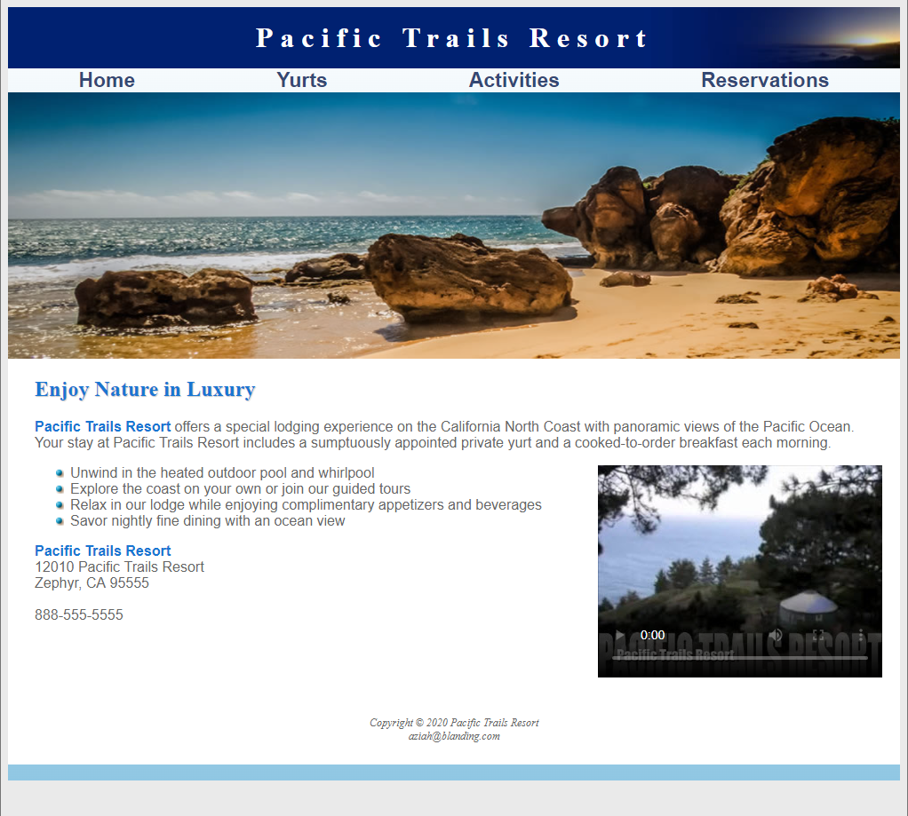

<h1 align="center">Pacific Trails Resort | <a href="https://pacifictrailsproj.netlify.app/">Demo</a></h1>

  

<h3 align="center">Good ol' yurts and trails!</h3>

<h2 align="left">How It's Made:</h2>

A traditional, light responsive resorts page using only HTML and CSS.
 

<!--Optimization-->
<h2 align="left">Optimizations</h2>

I will eventually come back and add some more responsiveness as well as make it more modern with some JavaScript. I could have also made an 'assets' folder to add organization to my files.
 

<!--Technologies-->
<h2 align="left">Technologies Used:</h2>

  
  

 

<!--What did I learn?-->
<h2 align="left">Lessons Learned:</h2>

Null

<!--Link to my other work/contributions-->
<h2 align="left">Other Projects:</h2>

**Got Cocktail?:** <a href="https://github.com/Primalsia/GotCocktail.github.io">Got Cocktail? Repo</a> 
**One Piece Character Selector:** <a href="https://github.com/Primalsia/One-Piece-Character-Selector">One Piece Character Selector Repo</a> 
**Portfolio:** <a href="https://github.com/Primalsia/PortfolioWeb2022">Portfolio Repo</a>

